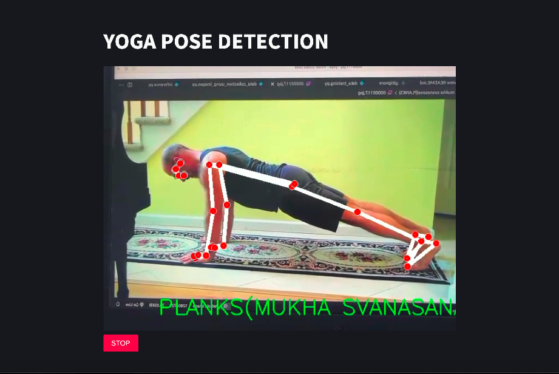

# YOGA-POSE-DETECTOR

<h1>Description</h1>

The Yoga Pose Detector is an AI-powered web application that predicts yoga poses in real-time using webcam input. Leveraging MediaPipe's advanced pose detection technology, the application captures and analyzes human body movements to identify specific yoga asanas with precision.

The core of the project is a deep learning model, constructed using a simple Dense network in Keras, and trained on a dataset of yoga poses. 

### The project is organized into three key components:

### Data Collection: 
Gathers pose data from video or image input for training purposes.
### Model Training:
Utilizes the collected data to train the neural network model.
### Inference:
Deploys the trained model to predict and classify yoga poses during live sessions.

The application is developed using Streamlit for the user interface and WebRTC for managing the webcam feed, ensuring a seamless and interactive user experience.

<h1>How to use it: </h1>
<h2>Run this command on terminal: </h2>

```
git clone https://github.com/AIOnGraph/YOGA-POSE-DETECTOR.git
``` 

<h1>Requirements</h1>

```
pip install -r requirements.txt
``` 
then for running the streamlit app:
``` 
streamlit run inference.py
``` 

<h1>How to Run?</h1>
<h2>Adding Data</h2>
  To add data you have to run <b>python data_collection.py</b> and  have to provide the name of asana you want to add.
 <h2>Training</h2>
  To train just run <b>python data_training.py</b> to train the model on newly added data.
  <h2>Running</h2>
  To Run just run <b>streamlit run inference.py</b> and new window will pop up which will be running the predictions.

  ## Samples of Demo:
  ### 1. BHUJANG ASANA:
  

  ### 2. PLANKS:
  

  ### 3. SUKH ASANA:
  

  ### 4. TRIKON ASANA:
  

  ### 5. VRIK ASANA:
  


  


  


  
